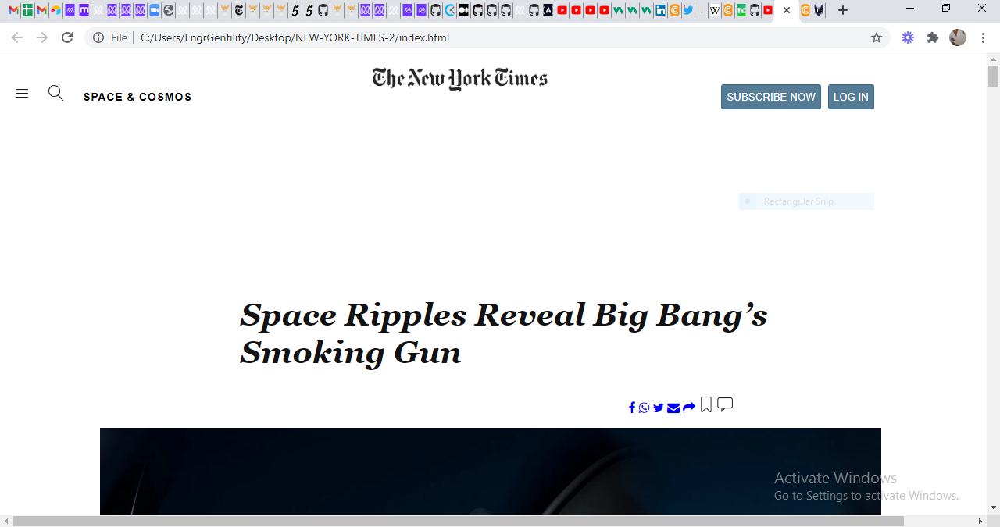

# NEW-YORK-TIMES
This is a floating and positioning prject where I placed images on grid in line with the articles using HTML5 and CSS3 only.

## The following are some   of the features of this project:

1. Has Nav bar
2. Has a header
3. Has Image grid
4. Has Socail media links
5. Has a footer

## Built With

- HTML5
- CSS3

## Getting Started 

For one to get started, just clone the repository and open index html file in your browser.

## Author

 **Ugbordiegwu Chimaijem S.**

- Github: [Gentilitysp](https://github.com/Gentilitysp)
- Twitter:[@chimaijemeze](https://twitter.com/ChimaijemEze)
- Linkedin: [Chimaijem Eze](https://www.linkedin.com/in/chimaijem-eze-585530134/)

# 🤝 Contributing
Contributions, issues, and feature requests are welcome!

Feel free to check the issues page.

## Show your support
Give a ⭐️ if you like this project!

## Acknowledgments
Hat tip to anyone whose code was used
Inspiration
etc
## 📝 License
This project is MIT licensed.